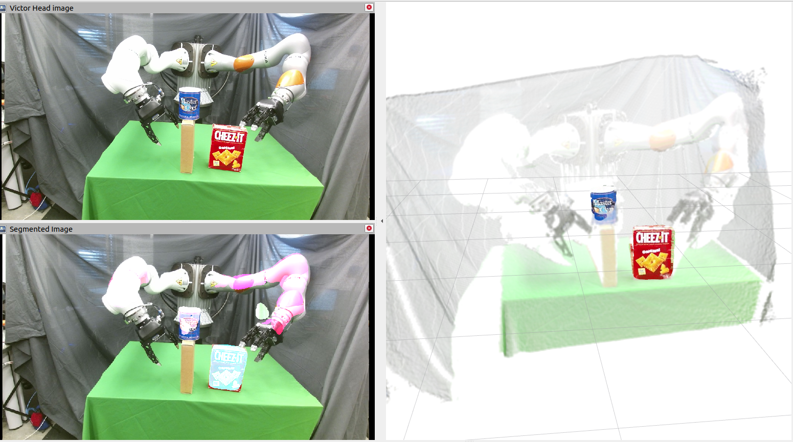

# ROS YCB Object Segmentation
This package provides an out-of-the-box ROS solution for segmenting YCB objects from a RGB camera and optionally republishing the segmented portion of a point cloud, if a depth image is provided.

## How to use
1. start the kinect: In the ARM Lab this can be done by: 

       ssh loki
       roslauch mps_launch_files kinect_vicon_real_robot.launch pov:="victor_head"
    
2. launch `roslaunch object_segmentation ycb_segmentation.launch objects:="1 2 3"`
3. View the results in rviz by opening the `segmented_view.rviz` config

The results:

The kinect publishes to a namespace (e.g. `/kinect2_victor_head/qhd/...`) specified in the launch file. 

This packages adds on several new topics to that namespace:
- `marked_image` the original image with colorful markings of the segmentation
- `segmentation_mask` a mask where each pixel has the value of the inferred object category
- `segmented_pointcloud` with just the points matching the object categories specified when launching

# Object Categories
The integer value of each pixel of the segmentation mask maps to a YCB object accoring to [this file](data/object_info.csv), copied below for convience:

|Idx|Name                      |
|---|--------------------------|
|0  | 000_background           |
|1  | 002_master_chef_can_16k  |
|2  | 003_cracker_box_16k      |
|3  | 004_sugar_box_16k        |
|4  | 005_tomato_soup_can_16k  |
|5  | 006_mustard_bottle_16k   |
|6  | 007_tuna_fish_can_16k    |
|7  | 008_pudding_box_16k      |
|8  | 009_gelatin_box_16k      |
|9  | 010_potted_meat_can_16k  |
|10 | 011_banana_16k           |
|11 | 019_pitcher_base_16k     |
|12 | 021_bleach_cleanser_16k  |
|13 | 024_bowl_16k             |
|14 | 025_mug_16k              |
|15 | 035_power_drill_16k      |
|16 | 036_wood_block_16k       |
|17 | 037_scissors_16k         |
|18 | 040_large_marker_16k     |
|19 | 051_large_clamp_16k      |
|20 | 052_extra_large_clamp_16k|
|21 | 061_foam_brick_16k       |

# Installation

Install the library (preferably in a virtual environment):

    pip install git+https://github.com/CSAILVision/semantic-segmentation-pytorch.git@master
    
Then clone this repo into your ros package path.

Additional dependencies:
- ROS
- pytorch
- `sudo apt install ros-[version]-image-geometry`
- `pip install googledrivedownloader`

For library errors, see [This repo](https://github.com/CSAILVision/semantic-segmentation-pytorch)

# Pretrained Models
The pretrained model for YCB objects should be downloaded automatically the first time you run this script. If not, manually downloaded the pretrained model to the `ckpt` directory:

https://drive.google.com/file/d/17eV88dp33_Kxqt3ke_C1DoRICeOICh-4/view?usp=sharing

# The segmentation is not good enough!
To train your own model, check out [my other github repo](https://github.com/bsaund/semantic-segmentation-pytorch)

## Credit
This is a ROS wrapper around a pytorch [library built by the MIT CSAIL Vision group](https://github.com/CSAILVision/semantic-segmentation-pytorch)
